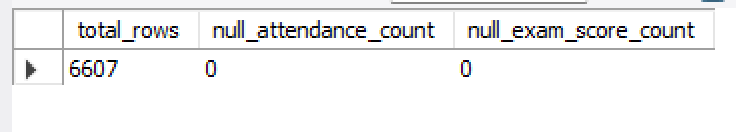
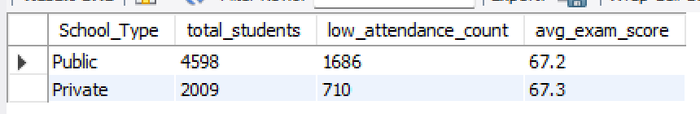
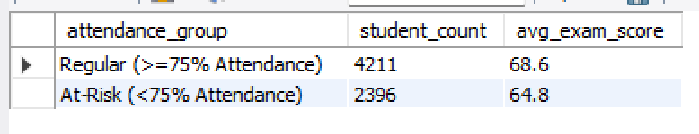

# 01. Student Data Integrity & Attendance Risk Analysis

## Project Overview
This module focuses on evaluating student data quality, ensuring relational integrity, and identifying academic risk factors for **6,607 student records**. The goal is to support institutional decision-making by auditing data anomalies and evaluating the impact of attendance on exam performance.

---

## Key SQL Queries & Results

### 1. Data Audit & Null Value Check
Ensured dataset completeness across critical fields before running compliance metrics.
```sql
SELECT COUNT(*) AS total_rows,
       SUM(CASE WHEN Attendance IS NULL THEN 1 ELSE 0 END) AS null_attendance_count,
       SUM(CASE WHEN Exam_Score IS NULL THEN 1 ELSE 0 END) AS null_exam_score_count
FROM student_performance;
```

- Result: 6,607 total rows processed with 0 null values in key performance fields.

### 2. Identifying At-Risk Students by School Type
Segmented students by attendance threshold (< 75%) to measure institutional risk exposure.
```sql
SELECT School_Type,
       COUNT(*) AS total_students,
       SUM(CASE WHEN Attendance < 75 THEN 1 ELSE 0 END) AS low_attendance_count,
       ROUND(AVG(Exam_Score), 1) AS avg_exam_score
FROM student_performance
GROUP BY School_Type;
```

- Public Schools: 4,598 students | 1,686 At-Risk (36.7%) | Avg Score: 67.2
- Private Schools: 2,009 students | 710 At-Risk (35.3%) | Avg Score: 67.3

### 3. Impact of Low Attendance on Performance
Evaluated the direct relationship between low attendance and final examination scores.
```sql
SELECT 
    CASE 
        WHEN Attendance < 75 THEN 'At-Risk (<75% Attendance)'
        ELSE 'Regular (>=75% Attendance)'
    END AS attendance_group,
    COUNT(*) AS student_count,
    ROUND(AVG(Exam_Score), 1) AS avg_exam_score
FROM student_performance
GROUP BY attendance_group;
```


## Key Insights & Recommendations:
- Students with regular attendance ($\ge 75\%$) achieve an average score of 68.6, compared to 64.8 for the at-risk group — representing a 3.8 point performance drop.
- High At-Risk Volume: 36.3% of the total cohort (2,396 students) exhibit attendance below 75%, demonstrating an institutional challenge that requires automated monitoring.
- Institutional Action: Early warning alerts should be integrated into reporting systems as soon as attendance dips below the 75% threshold.
