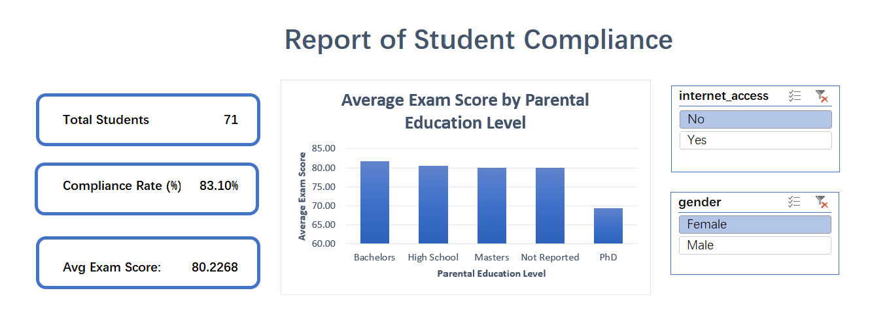

# 02. Student Attendance Compliance & Academic Performance Dashboard (Excel)

## Project Overview
Designed an interactive **Executive Excel Dashboard** to evaluate student attendance compliance, demographic factors, and academic performance across **1,000 student records** (`Student_Compliance_Dashboard.xlsx`). The project demonstrates core data governance, compliance modeling, and dynamic reporting capabilities aligned with higher education reporting requirements.

---

## Executive Dashboard Preview


> **Executive Deliverables Available:**
> - Full Interactive Workbook: [`Student_Compliance_Dashboard.xlsx`](Student_Compliance_Dashboard.xlsx)
> - Ready-to-Print PDF Report: [`Report_student_compliance.pdf`](Report_student_compliance.pdf)
> - Processed Dataset: [`cleaned_student_performance.csv`](cleaned_student_performance.csv)

---

## Technical Features & Implementation Step-by-Step

### 1. Data Governance & Cleansing (`01_Clean_Data`)
- **Missing Data Handling:** Handled non-reported entries in `parental_education` using logical formulas (`=IF(ISBLANK(...), "Not Reported", ...)`) to preserve data integrity across reporting categories.
- **Structured Table Format:** Converted raw records into an official Excel Table (`StudentData`) to allow scalable, dynamic range references.
- **Data Audit:** Audited missing values and duplicate rows prior to metric aggregation.

### 2. Institutional Compliance Logic
- **Compliance Classification:** Applied the standard 75% institutional attendance threshold:
  ```excel
  =IF([@[attendance_percent]]>=75, "Compliant", "Non-Compliant")
 
### 3. Dynamic KPIs & Pivot Data Model (02_Pivot_Tables & 03_Executive_Dashboard)
To ensure full interactivity, executive KPI scorecards were dynamically anchored to the underlying Pivot Tables. This enables real-time updates whenever Slicers are applied:
- Total Students: Dynamic headcount of the active student cohort (1,000 students).
- Attendance Compliance Rate (%): Real-time percentage of students meeting the 75% threshold (86.0%).
- Overall Average Exam Score: Institutional baseline exam score (83.5).
- Interactive Slicers: Connected cross-report filters for Gender and Internet Access driving all Pivot Charts and KPI cards simultaneously.

#### 4. Dashboard Visualizations
- Bar Chart: Average Exam Score by Parental Education Level — Evaluates academic outcomes by family background.
- Doughnut Chart: Attendance Compliance Distribution — Visualizes Compliant vs. Non-Compliant student proportions.
- Line Chart: Academic Performance Trend by Study Hours — Illustrates the relationship between weekly study time and final scores.

## Key Business Insights & Findings
- Baseline Compliance: 86.0% (860 students) meet or exceed attendance compliance standards, while 14.0% (140 students) are flagged as Non-Compliant.
- Academic Performance Penalty: Students in the Compliant group achieved an average score of 84.4, compared to 78.3 for Non-Compliant peers — demonstrating a 6.1-point academic penalty associated with low attendance.
- Socioeconomic Impact: Higher parental education levels consistently correlate with both higher attendance compliance and superior final examination outcomes.
