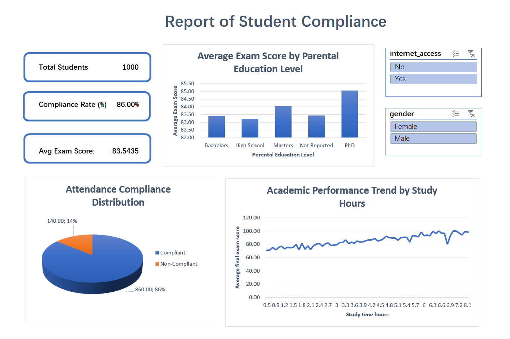

# 02. Student Attendance Compliance & Academic Performance Dashboard (Excel)

## Project Overview
Designed an interactive **Executive Excel Dashboard** to evaluate student attendance compliance, demographic factors, and academic performance across **1,000 student records** (`Student_Compliance_Dashboard.xlsx`). The project demonstrates core data governance, compliance modeling, and dynamic reporting capabilities aligned with higher education reporting requirements.

---

## Executive Dashboard Preview


> **Executive Deliverables Available:**
> - Full Interactive Workbook: [`Student_Compliance_Dashboard.xlsx`](Student_Compliance_Dashboard.xlsx)
> - Ready-to-Print PDF Report: [`Student_Compliance_Executive_Report.pdf`](Student_Compliance_Executive_Report.pdf)
> - Processed Dataset: [`cleaned_student_performance.csv`](cleaned_student_performance.csv)

---

## Technical Features & Implementation Step-by-Step

### 1. Data Governance & Cleansing (`01_Clean_Data`)
- **Missing Data Handling:** Handled non-reported entries in `parental_education` using logical formulas (`=IF(ISBLANK(...), "Not Reported", ...)`) to preserve data integrity across reporting categories.
- **Structured Table Format:** Converted raw records into an official Excel Table (`StudentData`) to allow scalable, dynamic range references.
- **Data Audit:** Audited missing values and duplicate rows prior to metric aggregation.

### 2. Institutional Compliance Logic
- **Compliance Classification:** Applied the standard 75% institutional attendance threshold:
  ```excel
  =IF([@[attendance_percent]]>=75, "Compliant", "Non-Compliant")
